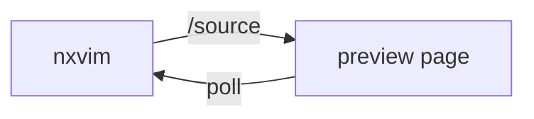

# nxvim-markdown-preview — sample

Open this file with the example config and run `:MarkdownPreview`:

    NXVIM_CONFIG=examples nxvim examples/sample.md

Then work down the list — each section is something to *type here* and *see there*, in the
browser, on the next poll (~500 ms). No `:write` needed.

## 1. Live edit

Put the cursor at the end of this line and type something. It appears in the preview
without saving — and only *this* paragraph is re-rendered, so nothing else on the page
flickers.

## 2. The cursor line

Move down through these lines:

- one
- two
- three

The block the cursor is in is highlighted in the preview. The "⭱ follow cursor" toggle at
the bottom of the sidebar also scrolls it into view; click it to turn that off, and the
highlight stays but the page holds still.

## 3. Code fences

Syntax-highlighted by highlight.js — by the fence's language, or auto-detected when it
names none.

```lua
local function greet(who)
  return ("hello, %s"):format(who)
end
```

```sh
nxvim --test-plugin .
```

## 4. Mermaid diagrams

A `mermaid` fence is rendered as a diagram. Break it (delete the `-->`) and only this block
falls back to text — the rest of the page keeps rendering, and the status stays `live`.



## 5. Relative images

The image below lives at `examples/img/logo.svg`, next to this file. The browser has no
filesystem, so the editor serves it over the mount's `/asset` route:


A root-relative path works too — `/examples/img/logo.svg` resolves against the workspace,
not the filesystem root. An `https:` or `data:` image is passed through to the browser
untouched.

## 6. Link navigation

[linked.md](linked.md) is not open as a buffer. Click it in the preview: the page navigates
there, reading it straight from disk. Open it for real (`:e examples/linked.md`) and the
preview switches to the live buffer, unsaved edits included.

## 7. Multiple buffers

Open another markdown file (`:e examples/linked.md`) and the sidebar lists both. Click one
to pin it; "⟳ follow editor" clears the pin so the page tracks whichever buffer you are in.

## 8. Stop it

`:MarkdownPreviewStop` retires the mount — the tab goes to "editor gone".
`:MarkdownPreview` binds it again at the same URL.
